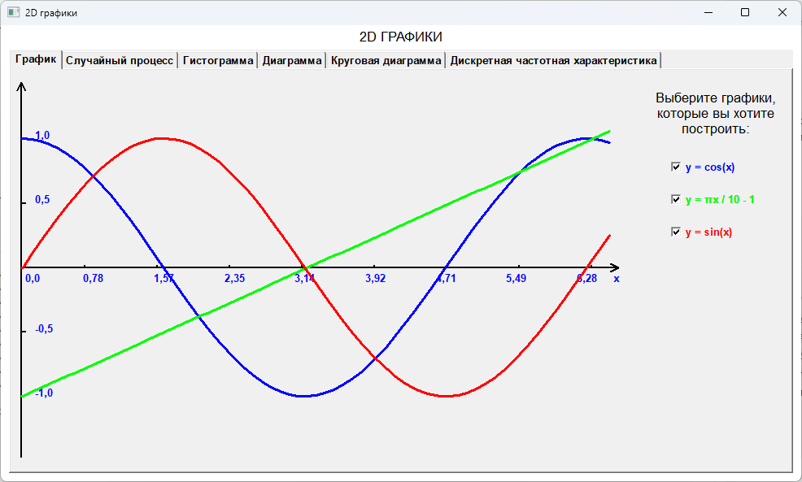
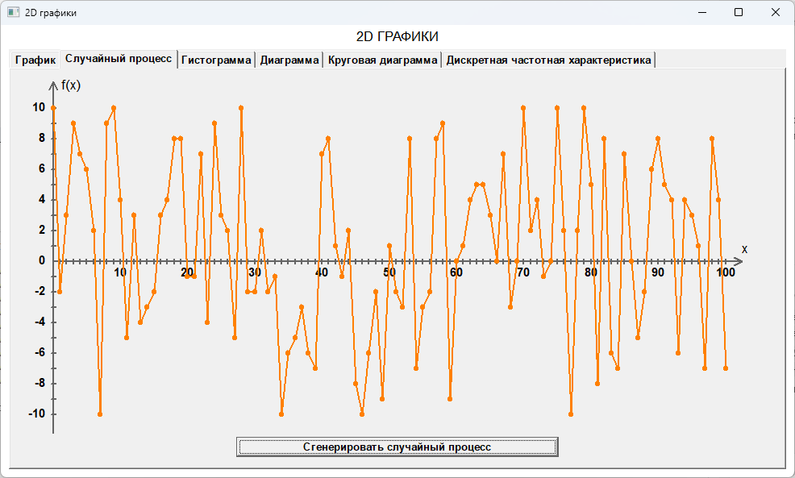
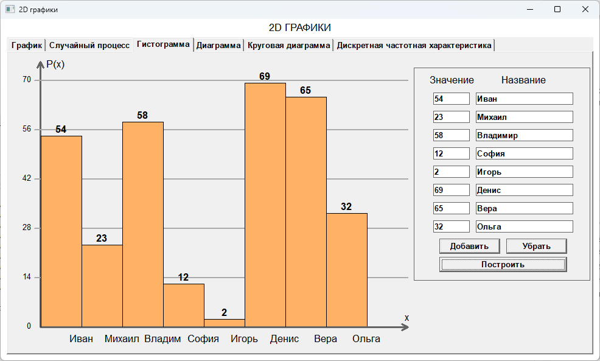
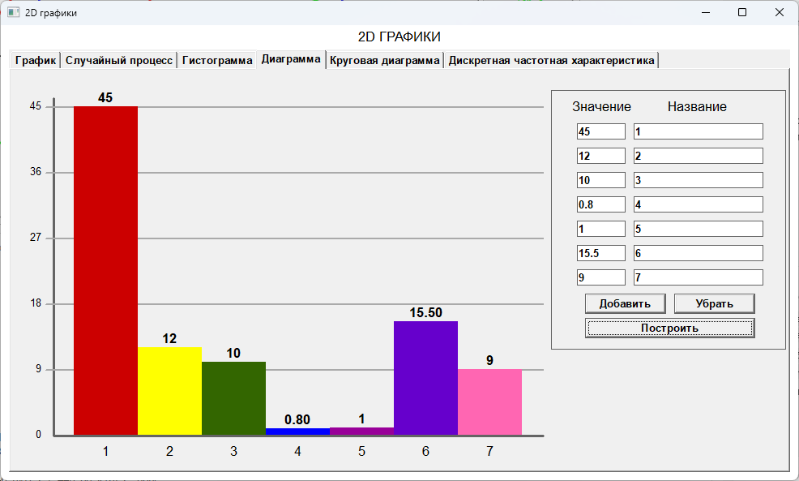
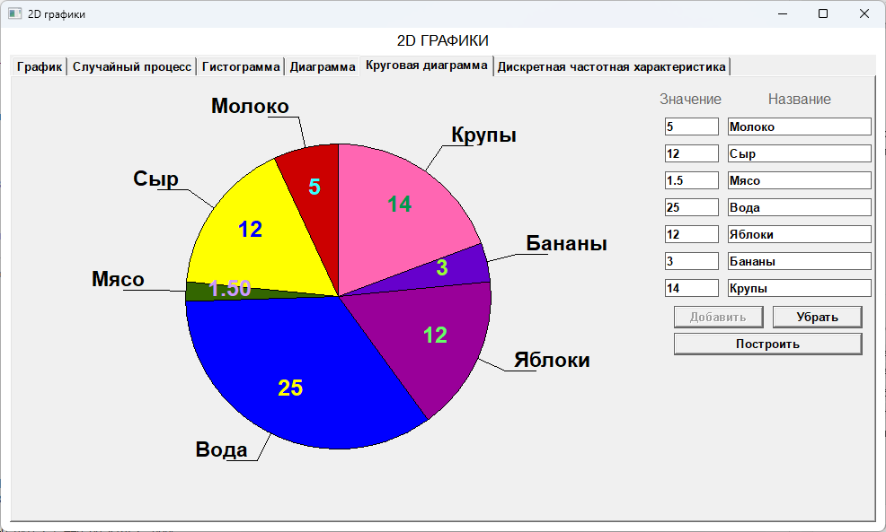
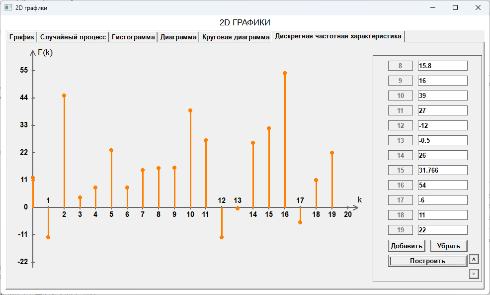

# 2D графики (WindowsProject4)

Десктопное Windows-приложение на C++ (WinAPI), которое строит несколько типов графиков и диаграмм по заданным пользователем данным.

## Что умеет приложение

- Линейные графики функций с выбором отображаемых кривых:
  - `y = cos(x)`
  - `y = πx / 10 - 1`
  - `y = sin(x)`
- График случайного процесса (101 точка) с генерацией по кнопке.
- Гистограмма с пользовательскими значениями и подписями столбцов.
- Столбчатая диаграмма с пользовательскими значениями и подписями.
- Круговая диаграмма с подписями секторов.
- Дискретная частотная характеристика.

## Типы визуализаций, поля и изображения

### 1) Линейные графики функций

Поля/элементы:
- Чекбокс `y = cos(x)`
- Чекбокс `y = πx / 10 - 1`
- Чекбокс `y = sin(x)`

### 2) Случайный процесс

Поля/элементы:
- Кнопка `Сгенерировать случайный процесс`

### 3) Гистограмма

Поля/элементы:
- Таблица ввода `Значение` + `Название` (динамическое число строк)
- Кнопка `Добавить`
- Кнопка `Убрать`
- Кнопка `Построить`
- Кнопки прокрутки (`Вверх`/`Вниз`) при большом числе строк

### 4) Столбчатая диаграмма

Поля/элементы:
- Таблица ввода `Значение` + `Название` (динамическое число строк)
- Кнопка `Добавить`
- Кнопка `Убрать`
- Кнопка `Построить`
- Кнопки прокрутки (`Вверх`/`Вниз`) при большом числе строк

### 5) Круговая диаграмма

Поля/элементы:
- Таблица ввода `Значение` + `Название` (до 7 секторов)
- Кнопка `Добавить`
- Кнопка `Убрать`
- Кнопка `Построить`

### 6) Дискретная частотная характеристика

Поля/элементы:
- Таблица ввода значений `F(k)` по индексам `k`
- Кнопка `Добавить`
- Кнопка `Убрать`
- Кнопка `Построить`
- Кнопки прокрутки (`Вверх`/`Вниз`) при большом числе строк

## Технологии

- C++
- WinAPI (`windows.h`, `CommCtrl`)
- Visual Studio toolset `v143`
- Проект Visual Studio: `WindowsProject4.sln`

## Требования

- Windows 10/11
- Visual Studio 2022 с workload **Desktop development with C++**
- Windows SDK (10.0)

## Сборка и запуск

1. Откройте решение [WindowsProject4.sln](/home/qwerty/temp/work/WindowsProject4.sln) в Visual Studio 2022.
2. Выберите конфигурацию `Debug` или `Release`.
3. Выберите платформу `x64` (или `Win32`).
4. Нажмите **Build** (`Ctrl+Shift+B`) и запустите проект (`F5` или `Ctrl+F5`).

## Структура проекта

- `WindowsProject4.cpp` - точка входа `WinMain`, главное окно и вкладки.
- `GraphPage.cpp` - вкладка линейных графиков.
- `RandomGraphPage.cpp` - вкладка случайного процесса.
- `HistogramPage.cpp` - вкладка гистограммы.
- `DiagramPage.cpp` - вкладка столбчатой диаграммы.
- `PieChartPage.cpp` - вкладка круговой диаграммы.
- `FrequencyPage.cpp` - вкладка частотной характеристики.

## Особенности ввода данных

- Для диаграмм предусмотрена валидация: пустые поля, некорректные символы и недопустимые значения обрабатываются с показом сообщения об ошибке.
- Для круговой диаграммы значения должны быть строго больше нуля.
